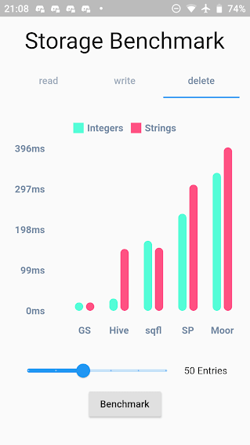
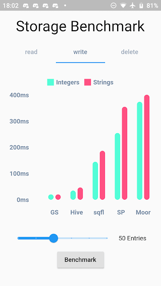
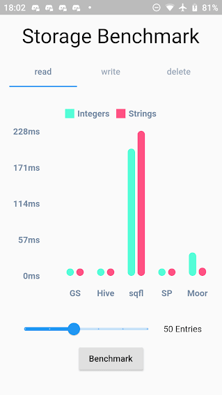

# get_storage
A fast, extra light and synchronous key-value storage written entirely in Dart to Get framework of Flutter.

Supports Android, iOS, Web, Mac, Linux, and fuchsia (Wip on Windows). 

Add to your pubspec:
```
dependencies:
  get_storage:
```

Initialize storage driver with await:
```dart
main() async {
  await GetStorage.init();
  runApp(App());
}
```
use GetStorage through an instance or use directly 'GetStorage().read('key')'
```dart
final box = GetStorage();
```
To write information you must use `write` :
```dart
box.write('quote', 'GetX is the best');
```

To read values you use `read`:
```dart
print(box.read('quote'));
// out: GetX is the best

```
To remove a key, you can use `remove`:

```dart
box.remove('quote');
```

To listen changes you can use `listen`:
```dart
box.listen((){
  print('box changed');
});
```
If you subscribe to events, be sure to dispose them when using:
```dart
box.dispose();
```
To erase your container:
```dart
box.erase();
```

If you want to create different containers, simply give it a name. You can listen to specific containers, and also delete them.

```dart
GetStorage g = GetStorage('MyStorage');
```

To initialize specific container:
```dart
await GetStorage.init('MyStorage');
```

**GetStorage is not fast, it is absurdly fast, so fast that you can write a file and then read it immediately.**





## What GetStorage is:
Persistent key/value storage for Android, iOS, Web, Linux, Mac and Fuchsia (soon to be Windows) that combines persistent storage with fast memory access.
## What GetStorage is NOT:
A database. Get is super compact to offer you a solution ultra-light, high-speed read/write storage to work synchronously. If you want to store data persistently, use it, if you want a database, with indexing there are incredible solutions that are already available, like Hive and Sqflite/Moor.


